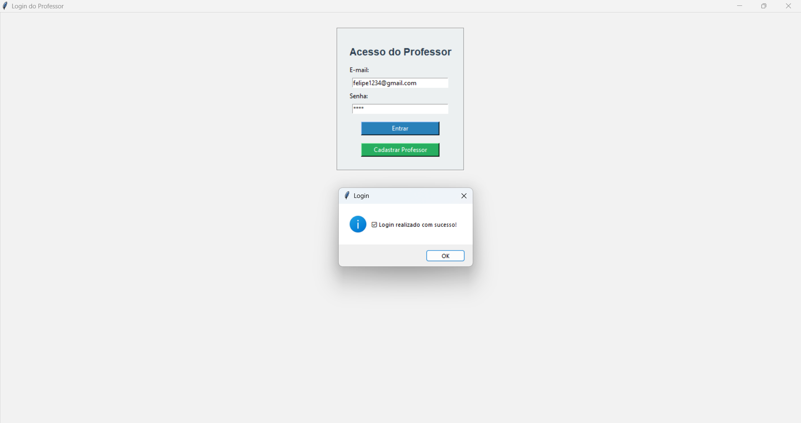
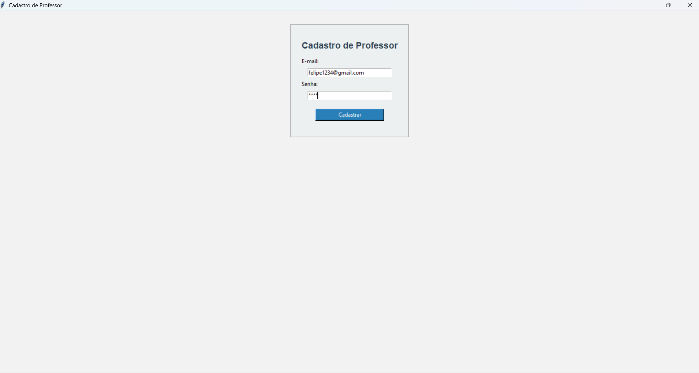
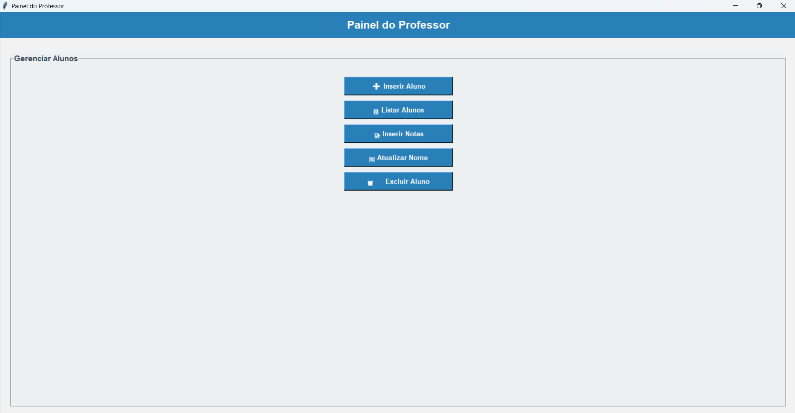

# PIM_UNIP
Projeto acadêmico desenvolvido para auxiliar professores no acompanhamento da situação dos alunos, permitindo o controle de notas, faltas, cadastro, RA e status de aprovação/reprovação.

Tecnologias: Python, C, biblioteca JSON e metodologias ágeis (Scrum).
---

## 🖥️ Protótipos do Sistema

### 🔐 Tela de Login do Professor

---

### 📝 Cadastro de Professor

---

### 📊 Gerenciamento de Alunos

